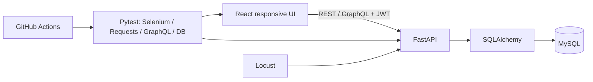

# ServiceHub QA Lab
## End-to-End Quality Engineering & Test Automation Portfolio

[](https://github.com/OWNER/servicehub-qa-lab/actions/workflows/qa.yml)

ServiceHub QA Lab is a **personal QA portfolio project** demonstrating a complete software testing lifecycle around a realistic appointment-booking application. It is not client work and makes no unexecuted quality, CI, or performance claims. The application is intentionally compact; requirements, risk, traceability, external behavior, and evidence are the focus.

| Area | Implementation |
|---|---|
| Manual Testing | 80 structured test cases |
| UI Automation | Selenium + Python + Pytest Page Objects |
| API Testing | Requests + Postman |
| Database Testing | MySQL + SQLAlchemy/SQL |
| GraphQL Testing | Strawberry endpoint + Pytest |
| Performance | Read-heavy Locust workload |
| CI/CD | GitHub Actions with MySQL and Chrome |
| Reporting | Pytest HTML + JUnit + failure screenshots |
| Test Design | SRS IDs + RTM + risk-based strategy |
| Documentation | Test plan, defect, release, learning, interview, demo guides |

## Why this project exists
Many beginner portfolios contain only login scripts. This repository connects requirement analysis → risk → manual design → automation at the right layer → database evidence → defects → regression → release decision. Its educational `QA_BUG_MODE` can make selected regressions detect isolated intentional faults while the default remains correct.

## Quality engineering scope
Functional, negative, boundary, authorization, integration, responsive web, REST, GraphQL, relational integrity, performance design, defect management, Agile participation, release criteria, cross-browser configuration, CI, and reporting are represented. Responsive browser tests are explicitly **not native mobile/Appium tests**.

## Architecture


### Technology stack
React, Vite, responsive CSS, Python 3.12, FastAPI, SQLAlchemy, MySQL 8.4, JWT, Strawberry GraphQL, Docker Compose; Selenium, Pytest, Requests, Postman, Locust, GitHub Actions.

## Test coverage
The SRS defines 18 traceable requirements. [`Test_Cases.csv`](docs/test-management/Test_Cases.csv) contains meaningful positive, negative, boundary, validation, integration, database, authorization, GraphQL, performance, and responsive cases. [`RTM.csv`](docs/test-management/RTM.csv) exposes partial automation honestly. High-risk double booking, ownership, cancellation, and persistence receive layered checks.

## Repository structure
```text
app/backend/          FastAPI, REST, GraphQL, models, rules, backend tests
app/frontend/         Responsive React client
automation/ui/        Selenium Page Objects, fixtures, browser tests
automation/api/       Live Requests contract and security tests
automation/database/  MySQL integrity queries
automation/graphql/   Live GraphQL tests
docs/                 SRS, plan, RTM, risks, defects, reports, diagrams
performance/          Non-destructive Locust workload
postman/              Collection and local environment
.github/workflows/    Reproducible QA pipeline
reports/              Runtime output (large/generated evidence ignored)
```

## Manual testing and traceability
Start with [`SRS.md`](docs/requirements/SRS.md), then [`Test_Plan.md`](docs/test-management/Test_Plan.md), cases, RTM, and [`Risk_Assessment.md`](docs/test-management/Risk_Assessment.md). Actual Result and Status intentionally begin as **Not executed/Not Run**; update only from a controlled build.

## Automation layers
- **UI:** critical register/login/search/book/view/cancel/responsive flows; Page Objects, explicit waits, stable test IDs, unique data, Chrome/Firefox CLI selection, screenshots on failure.
- **REST:** status/body/type/error/auth checks using isolated TestClient and live Requests suites.
- **Database:** orphan, status-domain, and provider/time duplicate queries against live MySQL.
- **GraphQL:** query, variables/filtering, invalid field, and protected resolver behavior.
- **Performance:** configurable read-heavy workload; see [`PERFORMANCE_TESTING.md`](docs/PERFORMANCE_TESTING.md). No results are invented.

## Defect and regression management
[`Bug_Reports.md`](docs/defects/Bug_Reports.md) maps optional mutations to requirements and regressions. The strategy distinguishes PR smoke, targeted change regression, full merge coverage, and release checks. QA bug mode is a teaching feature—not a claim of discovering defects in a real product.

## Quick start (Docker — recommended)
Prerequisites: Docker Desktop with Compose.

```bash
copy .env.example .env        # Windows Command Prompt; PowerShell: Copy-Item .env.example .env
docker compose up --build -d
docker compose ps
```

Open UI `http://localhost:5173`, API docs `http://localhost:8000/docs`, GraphQL `http://localhost:8000/graphql`.

Demo accounts seeded into a new database:
- Admin: `admin@servicehub.example` / `Admin123!`
- Provider: `provider@servicehub.example` / `Provider123!`

These are local demo values only. Change them for any public deployment.

## Run tests
Install tooling: `python -m pip install -r requirements.txt`. Keep the Docker stack running.

```bash
pytest app/backend/tests
pytest -m smoke
pytest -m regression
pytest automation/api -m api
pytest automation/database -m database
pytest automation/graphql app/backend/tests/test_graphql.py -m graphql
pytest automation/ui -m ui --browser chrome
pytest automation/ui -m ui --browser firefox
pytest --html=reports/report.html --junitxml=reports/junit.xml
```

Windows PowerShell uses the same commands. If `make` is available, equivalent targets are `make start`, `make smoke`, `make regression`, `make api-test`, `make ui-test`, `make db-test`, and `make graphql-test`.

Locust:
```bash
locust -f performance/locustfile.py --host http://localhost:8000
# controlled headless example
locust -f performance/locustfile.py --host http://localhost:8000 --headless -u 10 -r 2 -t 2m
```

Stop: `docker compose down`. Add `-v` only when you intentionally want to delete local MySQL data.

## QA bug demonstration mode
```powershell
$env:QA_BUG_MODE='true'; docker compose up --build -d
pytest app/backend/tests -m regression
```
Return it to false and rebuild afterward. Read defect notes first: all five documented demo mutations are enabled only in bug mode; default mode remains the supported behavior.

## CI/CD and reports
The workflow provisions MySQL, builds the frontend, starts FastAPI/Vite, waits on real health endpoints, runs backend/API/GraphQL/database and Chrome smoke suites, and uploads HTML/JUnit/screenshots even after failure. Replace `OWNER` in the badge after publishing. A badge is not proof until the repository's workflow has run.

## Key quality risks
Unauthorized record access, double booking, cancellation/storage inconsistency, timezone boundaries, and inactive-service availability. Release criteria treat security/integrity and smoke failures as No-Go.

## What I learned
The repository demonstrates that useful QA work begins with testable requirements and risk, uses the cheapest reliable layer, reconciles system state, records uncertainty, and makes release recommendations from evidence rather than raw script counts.

## Future improvements
UTC-aware time handling, Alembic migrations, database-level active-slot constraint strategy, true concurrent booking tests, richer provider/admin UI, WCAG accessibility checks, token revocation, contract generation, Firefox CI matrix, and real controlled baseline results.

## Study order
1. `docs/requirements/SRS.md`
2. `docs/test-management/Test_Plan.md`
3. `docs/test-management/Test_Cases.csv` and `RTM.csv`
4. `app/backend/app/main.py`
5. `automation/ui/tests/test_booking.py` and `app/backend/tests/test_api.py`

Then use [`LEARNING_GUIDE.md`](LEARNING_GUIDE.md), [`INTERVIEW_GUIDE.md`](INTERVIEW_GUIDE.md), and [`DEMO_GUIDE.md`](DEMO_GUIDE.md).


